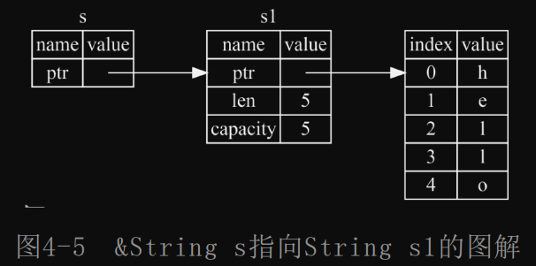
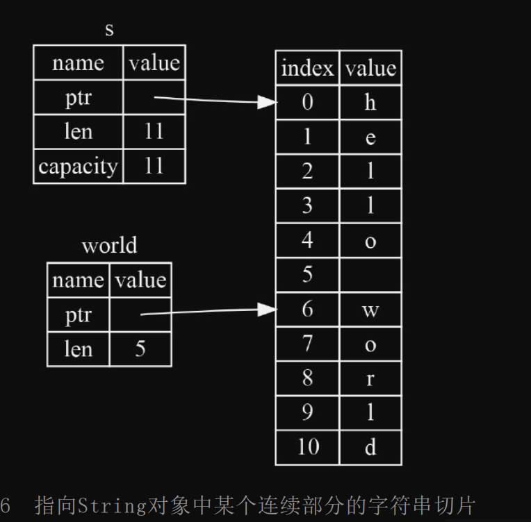

# learnrust

我学习rust过程中的笔记，描述较为精简，省取了推导过程，并不适合他人阅读。

- [learnrust](#learnrust)
  - [安装](#安装)
  - [cargo常用命令](#cargo常用命令)
  - [语法和基本概念](#语法和基本概念)
    - [变量及可变性](#变量及可变性)
    - [常量](#常量)
    - [隐藏](#隐藏)
    - [数据类型](#数据类型)
      - [标量类型 scalar](#标量类型-scalar)
      - [复合类型 compound](#复合类型-compound)
    - [语句和表达式](#语句和表达式)
    - [函数](#函数)
    - [注释](#注释)
    - [控制流（分支、循环、跳转）](#控制流分支循环跳转)
    - [所有权](#所有权)
      - [所有权规则：](#所有权规则)
      - [字符串、drop、移动、克隆、拷贝](#字符串drop移动克隆拷贝)
      - [所有权与函数： 所有权转移](#所有权与函数-所有权转移)
      - [引用和借用](#引用和借用)
      - [切片 slice](#切片-slice)
    - [结构体](#结构体)
    - [枚举](#枚举)
      - [Option](#option)
      - [match](#match)
    - [crate package module](#crate-package-module)
    - [通用集合类型](#通用集合类型)
      - [动态数组](#动态数组)
      - [字符串](#字符串)
      - [哈希映射](#哈希映射)
    - [错误处理](#错误处理)
    - [泛型 trait 生命周期](#泛型-trait-生命周期)
      - [泛型 减少重复代码](#泛型-减少重复代码)
      - [trait 定义共享行为](#trait-定义共享行为)
      - [生命周期](#生命周期)
    - [自动化测试](#自动化测试)
      - [单元测试](#单元测试)
      - [cargo test常用命令](#cargo-test常用命令)
      - [测试的组织结构](#测试的组织结构)
    - [闭包(没学会)](#闭包没学会)
    - [迭代器](#迭代器)
    - [智能指针](#智能指针)
      - [引用](#引用)
      - [Box](#box)
      - [Rc](#rc)
      - [RefCell](#refcell)
    - [无畏并发](#无畏并发)
    - [面向对象编程](#面向对象编程)
    - [模式匹配](#模式匹配)


## 安装

一行代码安装，需要代理，不需要sudo

```bash
curl --proto '=https' --tlsv1.2 -sSf https://sh.rustup.rs | sh
```

## cargo常用命令

```bash
# 新建项目
cargo new xxx
# 运行项目
cargo run
cargo run -- arg1 arg2 arg3
# 编译、构建
cargo build
cargo build --release
# 检查
cargo check
```

## 语法和基本概念

### 变量及可变性

1. 变量声明使用关键字：let
2. 变量可变性，mut关键字
3. 命名方式：蛇形命名

```rust
//变量默认不可变，
let a = 1;
//想改变就要加mut关键字
let mut a = 1；
a = 2；
```

### 常量

1. 不能用mut修饰常量，常量永远不可变
2. 常量使用使用关键字：const
3. 常量声明必须显式的指明类型
4. 常量可以在任何作用域声明，常量在哪都能用
5. 约定俗成，常量名称全大写
6. 常量只在声明的作用域内有效
```rust
const MAX_POINTS: u32 = 100_000;
```

### 隐藏

1. 同名变量可以隐藏前一个变量，
2. 隐藏时可以变更变量类型

```rust
let a = 1;
let a = 2;
let a = "hello"; 
```

### 数据类型

#### 标量类型 scalar

1. 整数类型

    | 长度   | 有符号 | 无符号 |
    | ------ | ------ | ------ |
    | 8-bit  | i8     | u8     |
    | 16-bit | i16    | u16    |
    | 32-bit | i32    | u32    |
    | 64-bit | i64    | u64    |
    | arch   | isize  | usize  |

2. 整数字面值

    | 整数字面量      | 示例         |
    | --------------- | ------------ |
    | Byte（u8 only） | b'A'         |
    | Octal           | 0o77         |
    | Decimal         | 100_0000_000 |
    | Hex             | 0xff         |
    | Binary          | 0b11111      |

3. 整数的默认推导类型为i32

4. debug模式下，整数溢出会panic

5. 浮点类型：f32、f64

6. 浮点数默认推到类型为f64

7. 布尔类型bool

8. 字符类型char： 占4字节，表示unicode字符。

#### 复合类型 compound

1. 元组tuple：类型可以不同，长度固定

    ```rust
    // 元组定义
    let tup: (i32, f64, u8) = (500, 6.4, 1);
    // 元组解构
    let (x, y, z) = tup;
    // 元组访问
    let five_hundred = tup.0;
    let six_point_four = tup.1;
    ```

2. 数组array：类型相同，长度固定

    ```rust
    // 定义数组,注意数组类型是如何定义的
    let a0 = [i32; 5];
    let a1:[i32; 5] = [1, 2, 3, 4, 5];
    // 访问数组元素
    let first = a[0];
    // 数组越界，会panic
    let index = 10;
    let element = a[index];
    ```

### 语句和表达式

语句指那些执行操作但**不返回值**的指令，而表达式则是指会进行计算并产生一个值作为结果的指令。

```rust
let y = 6; // 语句
fn main() { let y = 6; } // 语句
// 上述都是语句，它们都不返回值

5+6 // 表达式
let y = 5+6； // 表达式作为语句的一部分
let y = 11； // 11 也是一个表达式，它返回11这个值
```

调用函数是表达式 ！！！

调用宏是表达式 ！！！

我们用来创建新作用域的花括号（{}）同样也是表达式 ！！！

代码块输出的值就是其中最后一个表达式的值 !!!

### 函数

1. 命名方式：蛇形命名,下划线命名
2. 函数参数(形参)，为函数传参（实参）
3. 函数有多个语句构成，可以以表达式结尾。
4. 返回值： -> 函数最后一个表达式，作为函数返回值
   1. 没有返回值： -> ()
   2. 一个返回值： -> i32
   3. 多个返回值： -> (i32, i32)

```rust
fn add(x: i32, y: i32) -> i32 {
    x + y
}
```

### 注释

```rust
// 这是个单行注释
/*
    这里是块注释
*/
```

### 控制流（分支、循环、跳转）

```rust
//
fn main(){
    let n:i32 = 3;
    // if 语句的基本用法
    if n > 5 {
        println!("number greater than 5");
    } else if n < 5 {
        println!("number lower than 5");
    } else {
        println!("number equal 5");
    }


    //判断中，不允许将数字转换为bool类型
    //if n {
    if n!=0 {
        println!("number is not zero");
    }

    // if语句是一个表达式，返回值可以给变量赋值
    // if语句中，各个块返回类型必须相同。
    let condition = true;
    let number = if condition { 5 } else { 6 };
    println!("The value of number is: {}", number);
    
    //loop语句基本用法,循环，使用break返回
    let i = 1;
    loop {
        if i > 10 {
            break;
        }
        println!("helloworld: {i}");
        i = i + 1;
    }

    // loop表达式，通过break返回值
    let i2:i32 = loop {
        break 100;
    }

    // break关键字跳出多重循环，相当于goto
    'outer: loop {
        println!("Entered the outer loop");
        'inner: loop {
            println!("Entered the inner loop");
            break 'outer;
        }
        println!("This point will never be reached");
    }

    // while循环
    let mut n1 = 3；
    while n1 != 0 {
        println!("number: {n1}");
        n1 = n1 - 1;
    }

    // for循环，迭代器知识不在这讲
    let a = [10, 20, 30, 40, 50];
    for element in a {
        println!("the value is: {}", element);
    }
}
```

### 所有权

#### 所有权规则：

1. Rust中的每个**值**都有一个被称为其所有者的变量。
2. **值**在任意时刻只能有一个所有者。
3. 所有者离开作用域，这个**值**将被丢弃。

#### 字符串、drop、移动、克隆、拷贝

```rust
// 字符串
"hello world" // 字符串字面量, 被硬编码进程序中。
let s = String::from("hello world");
let mut s = String::from("hello");
s.push_str(", world!"); // push_str() 函数向String空间的尾部添加了一段字面量

{
    let s = String::from("hello"); // s 进入作用域
}// 这里，s 离开作用域并被丢弃。调用drop函数，内存被释放


let s1 = String::from("hello");
let s2 = s1; // s1 被废弃，它的值被移动到了s2中， 如果后续还使用s1，编译器就会报错。
let s3 = s2.clone(); // 克隆，复制一份

let x = 5;
let y = x; // 拷贝
// 整型的类型可以在编译时确定自己的大小，并且能够将自己的数据完整地存储在栈中，对于这些值的复制操作永远都是非常快速的。
// Rust提供了一个名为Copy的trait，它可以用于整数这类完全存储在栈上的数据类型。一旦某种类型拥有了Copy这种trait，那么它的变量就可以在赋值给其他变量之后保持可用性。
// 如果一种类型本身或这种类型的任意成员实现了Drop这种trait，那么Rust就不允许其实现Copy这种trait。 !!!!
```

- 将所有权yield给另一个变量，称为移动，移动后，原来的变量就不能使用了，移动类似浅拷贝

#### 所有权与函数： 所有权转移

```rust
fn myprint(s: String)->String{
    println!("{}",s);
    s
}
fn main(){
    let s = String::from("hello");
    let res = myprint(s); // s的所有权转移到了myprint函数中，s在这里不可用
    // 但是，myprint函数返回了一个String，这个String的所有权又转移到了res中
    println!("{}",s); // 这里会报错
    println!("{}",res); // 这里可以正常打印
}
```

#### 引用和借用

```rust
let s1 = String::from("hello");
let s = &s1; // s是s1的引用，s1的所有权没有转移
```



```rust
let s = String::from("hello");
let s1 = &s;     // 默认情况下，引用不可变

let s2 = &mut s; // 使用mut，绑定可变引用
let s3 = &mut s; // 非法，不能创建两个可变引用
let s4 = &s;     // 合法，创建多个不可变引用
```

- 借用：这是个动词，引用变量的创建过程，就是在借用xx变量的值


#### 切片 slice

- 切片不持有所有权
- 切片是对集合的引用
- 字符串切片：&str，部分引用字符串
    ```rust
        let s = String::from("hello world");

        let hello = &s[0..5];
        let world = &s[6..11];
    ```
    
- 范围区间：左闭右开
    ```rust
    let s = String::from("hello world");
    let s1 = &s[1..5]; // 左闭右开
    let s2 = &s[..5]; // 从0开始
    let s3 = &s[6..]; // 到结尾
    let s4 = &s[..]; // 全部
    ```
- 字符串字面量就是切片`let s = "hello world";`

- 数组切片，也一样

    ```rust
    let a = [1, 2, 3, 4, 5];
    let slice0 = &a[1..3];
    let slice1 = &a[1..]; // 从1开始到结尾
    let slice1 = &a[0..3]; // 从0开始到3
    ```

### 结构体

1. 定义、实例化
```rust
// 定义结构体
struct User {
    active: bool,
    username: String,
    email: String,
    sign_in_count: u64,
}

fn main() {
    // 创建结构体实例
    let user1 = User {
        email: String::from("someone@example.com"),
        username: String::from("someusername123"),
        active: true,
        sign_in_count: 1,
    };
    // 访问结构体字段
    user1.email = String::from("anotheremail@example.com");

    // 使用结构体更新语法从其他实例创建实例
    let user2 = User {
        email: String::from("aaa@bbb.com"),
        ..user1 // 使用..语法，剩余字段使用user1的值
}
```

2. 元组结构体：没有字段名，只有字段类型
```rust
struct Color(i32, i32, i32);
struct Point(i32, i32, i32);

let black = Color(0, 0, 0);
let black_r = black.0;
let origin = Point(0, 0, 0);
```

3. 单元结构体：没有字段
```rust
struct AlwaysEqual;

let subject = AlwaysEqual;
```

4. 为结构体实现方法
```rust
// 定义结构体
struct Rectangle {
    width: u32,
    height: u32,
}
struct Rectangle {
    width: u32,
    height: u32,
}

impl Rectangle {
    // 获取所有权
    fn consume(self) {}

    // 借用所有权，&self 实际上是 self: &Self 的缩写
    fn inspect(&self) {}

    // 可变借用所有权
    fn enlarge(&mut self) {
        self.width *= 2;
        self.height *= 2;
    }

    // 关联函数，在一个 impl 块中，Self 类型是 impl 块的类型的别名
    fn square(size: u32) -> Self {
        Self {
            width: size,
            height: size,
        }
    }
}
```

### 枚举

```rust
// 枚举定义
enum IpAddrKind {
    V4,
    V6,
}
// 枚举实例化
let four = IpAddrKind::V4;
let six = IpAddrKind::V6;
// 枚举绑定类型
enum IpAddr {
    V4(String),
    V6(String),
}
let home = IpAddr::V4(String::from("127.0.0.1"));
let loopback = IpAddr::V6(String::from("::1") );

// 为枚举定义方法
impl IpAddr {
    fn call(&self) {
        // 在这里定义方法体
    }
}
home.call();
```

#### Option
    
```rust
// Option<T> 枚举
enum Option<T> {
    Some(T),
    None,
}

// Option<T> 枚举的使用
fn main() {
    let some_number = Some(5);
    let some_string = Some("a string");
    let absent_number: Option<i32> = None;
}
```

#### match

```rust
// match
fn main() {
    let some_u8_value = 0u8;
    match some_u8_value {
        1 => println!("one"),
        3 => println!("three"),
        5 => println!("five"),
        7 => println!("seven"),
        _ => (), // _ 通配符，匹配所有值
    }
}

// 绑定值的模式
enum Coin {
    Penny,
    Nickel,
    Dime,
    Quarter(UsState),
}

fn value_in_cents(coin: Coin) -> u8 {
    match coin {
        Coin::Penny => {
            println!("Lucky penny!");
            1
        },
        Coin::Nickel => 5,
        Coin::Dime => 10,
        Coin::Quarter(state) => {
            println!("State quarter from {:?}!", state);
            25
        },
    }
}

// 匹配Option<T>
fn plus_one(x: Option<i32>) -> Option<i32> {
    match x {
        None => None,
        Some(i) => Some(i + 1),
    }
}

// if let 语法糖，只匹配一个值，不需要穷尽性
fn main() {
    let some_u8_value = Some(0u8);
    match some_u8_value {
        Some(3) => println!("three"),
        _ => (),
    }
    // 等价于
    if let Some(3) = some_u8_value {
        println!("three");
    }
}

```

### crate package module

1. crate有两种类型：binary crate和library crate
```shell
cargo new xxx # 默认是binary crate
cargo new yyy --lib # 创建library crate
```
2. crate中包含package
   1. 一个crate中最多一个library package（一个包最多只能有一个库lib.rs）
   2. 一个crate中可以有多个binary package（包中可以有多个包含main函数的binary package，类似于go中命令模板文件的概念）
3. module，模块，用于组织代码，控制作用域和私有性（我认为跟把代码放进一个文件差不多，一个模块就是一个文件）
4. 模块树中的路径表示
   1. 绝对路径：从根部（crate）开始，以crate名(引用外部crate)或者字面值crate(library crate中)开始
   2. 相对路径：从当前模块开始，self， super，同级模块
5. pub关键字暴露路径，否则默认私有
   1. 枚举默认是公共的
   2. 结构体字段遵循了默认的私有性规则，除非被标记为pub，否则默认是私有的
6. use将路径导入作用域，引入后就不再需要每次都输入路径了。use 类似于创建一个软连接
7. use引入两个同名类型就会有冲突，使用as关键字重命名
8. use引入的路径是私有的，如果想要公开，需要使用pub use
9. rust怎样拆分mod，文件夹、文件又是怎样组织的？？？？


### 通用集合类型

#### 动态数组

```rust
fn test_vec() {
    // 创建一个空的 Vec<i32>
    let mut vec1: Vec<i32> = Vec::new();

    // 使用宏创建一个包含初始元素的 Vec
    let mut vec2 = vec![1, 2, 3];

    // 向 Vec 中添加元素
    vec1.push(1);
    vec1.push(2);
    vec1.push(3);

    let mut vec3 = Vec::new();
    vec3.push(1); // vec3可以不指定泛型类型，因为根据这一句可以推导

    // 通过索引访问 Vec 中的元素
    let second_element = vec1[1];
    println!("The second element is {}", second_element);

    // 遍历 Vec 中的元素
    for element in &vec1 {
        println!("{}", element);
    }

    // 为了修改元素内容
    for element in &mut vec2 {
        *element += 1;
    }

    // 修改 Vec 中的元素
    vec2[0] = 4;

    // 删除 Vec 中的元素
    vec2.remove(2);

    // 获取 Vec 的长度
    let vec2_length = vec2.len();
    println!("The length of vec2 is {}", vec2_length);

    // 检查 Vec 是否为空
    if vec1.is_empty() {
        println!("vec1 is empty");
    } else {
        println!("vec1 is not empty");
    }

    // 使用 Vec 的方法进行排序
    vec2.sort();
    println!("vec2 after sorting: {:?}", vec2);
}
```

#### 字符串

```rust
fn test_string() {
    // 创建一个空的 String
    let mut string1 = String::new();

    // 使用字符串字面量创建一个 String
    let string2 = String::from("hello");

    // 使用 format! 宏创建一个 String
    let string3 = format!("{} {}", "hello", "world");

    // 向 String 中添加字符
    string1.push('h');
    string1.push('e');
    string1.push('l');
    string1.push('l');
    string1.push('o');

    // 向 String 中添加字符串
    string1.push_str(", world!");

    // 使用索引访问 String 中的字符
    //let first_char = string1[0]; // 这样是不行的，因为 Rust 不知道应该返回什么类型
    let first_char = string1.chars().nth(0).unwrap();
    println!("The first character is {}", first_char);

    // 使用切片访问 String 中的子串
    let hello = &string1[0..5];
    println!("The first five characters are {}", hello);

    // 连接两个 String
    let string4 = string2 + " world!";
    println!("string4 = {}", string4);

    // 使用 String 的方法进行查找和替换
    let replaced = string4.replace("world", "Rust");
    println!("replaced = {}", replaced);

    // 获取 String 的长度
    let string1_length = string1.len();
    println!("The length of string1 is {}", string1_length);

    // 检查 String 是否为空
    if string1.is_empty() {
        println!("string1 is empty");
    } else {
        println!("string1 is not empty");
    }
}
```

#### 哈希映射

1. 一旦键值对被插入，其所有权就会转移给哈希映射
2. 哈希映射中的所有键都必须是相同类型，值也必须都是相同类型
```rust
fn test_hashmap() {
    use std::collections::HashMap;
    // 创建一个空的 HashMap
    let mut map1: HashMap<i32, &str> = HashMap::new();

    // 向 HashMap 中添加元素
    map1.insert(1, "one");
    map1.insert(2, "two");
    map1.insert(3, "three");

    // or_insert
    map1.entry(1).or_insert("ONE");

    // 通过键访问 HashMap 中的元素
    let value = map1.get(&2);
    println!("The value of key 2 is {:?}", value);

    // 遍历 HashMap 中的元素
    for (key, value) in &map1 {
        println!("{}: {}", key, value);
    }

    // 修改 HashMap 中的元素
    map1.insert(1, "ONE");

    // 删除 HashMap 中的元素
    map1.remove(&2);

    // 获取 HashMap 的长度
    let map1_length = map1.len();
    println!("The length of map1 is {}", map1_length);

    // 检查 HashMap 是否为空
    if map1.is_empty() {
        println!("map1 is empty");
    } else {
        println!("map1 is not empty");
    }
}
```

### 错误处理

1. 不可恢复错误与panic
```rust
fn get_by_index(arr: &Vec<i32>, index: usize)->i32{
    if arr.len() == 0 || arr.len() <= index {
        panic!("Array is empty");
    }
    arr[index]
}

fn main() {
    let arr = vec![1,2,3,4,5];
    let result = get_by_index(&arr, 100);
    println!("The value at index {} is {}", 100, result);
}
```

2. 可恢复错误与Result
```rust
/* 注意：Result<T, E> 是一个枚举类型！！！！,不过如此
enum Result<T, E> {
    Ok(T),
    Err(E),
}
*/

use std::fs::File;
fn main() {
    let f = File::open("hello.txt");
    // match 处理 Result
    let f = match f {
        Ok(file) => file,
        Err(error) => {
            panic!("There was a problem opening the file: {:?}", error)
        }
    };

    // unwrap: 返回的不是 Ok 就是 panic!，ok() 就返回 Ok 中的值
    let f = File::open("hello.txt").unwrap();

    // expect: 和 unwrap 一样，但是可以自定义 panic! 的错误信息
    let f = File::open("hello.txt").expect("Failed to open hello.txt");

    use std::fs::File;
    use std::io;
    use std::io::Read;
    
    // 传播错误
    // ? 语法糖，当返回为错误时，自动return Err(error)
    fn read_username_from_file() -> Result<String, io::Error> {
        let mut f = File::open("hello.txt")?;
        let mut s = String::new();
        f.read_to_string(&mut s)?;
        Ok(s)
    }
}
```

### 泛型 trait 生命周期

#### 泛型 减少重复代码
```rust
// 在函数中定义
fn largest<T>(list: &[T]) -> T {
    let mut largest = list[0];
    for &item in list.iter() {
        if item > largest {
            largest = item;
        }
    }
    largest
}
// 在结构体中定义
struct Point<T, U> {
    x: T,
    y: U,
}
fn main() {
    let wont_work = Point { x: 5, y: 4.0 };
}
// 在枚举中定义
enum Option<T> {
    Some(T),
    None,
}
// 在方法中定义
impl<T,U> Point<T,U> {
    fn x(&self) -> &T {
        &self.x
    }
    fn y(&self) -> &U {
        &self.y
    }
}
```

泛型代码的**性能问题**：rust通过在编译时进行泛型代码的**单态化**来保证效率

#### trait 定义共享行为

trait与其他语言中常被称为接口（interface）的功能类似，但也不尽相同。

```rust
// 定义trait
pub trait Summary {
    fn summarize(&self) -> String;
}

// 实现trait
pub struct NewsArticle {
    pub headline: String,
    pub location: String,
    pub author: String,
    pub content: String,
}
impl Summary for NewsArticle {
    fn summarize(&self) -> String {
        format!("{}, by {} ({})", self.headline, self.author, self.location)
    }
}

// 默认实现， trait中的方法可以有默认实现，不想用也可以自己实现（重载）
pub trait Summary {
    fn summarize(&self) -> String {
        String::from("(Read more...)")
    }
}

// trait作为参数
pub fn notify(item: impl Summary) {
    println!("Breaking news! {}", item.summarize());
}

// 多个trait作为参数 加号
pub fn notify(item: impl Summary + Display) {}

// trait约束
pub fn notify<T: Summary>(item1: T, item2: T) {
    println!("Breaking news! {}", item1.summarize());
    println!("Breaking news! {}", item2.summarize());
}

// 多个trait约束
pub fn notify<T: Summary + Display>(item: T) {}

// where语法
fn some_function<T: Display + Clone, U: Clone + Debug>(t: T, u: U) -> i32 {}
// 等价于
fn some_function<T, U>(t: T, u: U) -> i32
    where T: Display + Clone,
          U: Clone + Debug
{}

// trait作为返回值
fn returns_summarizable() -> impl Summary {
    Tweet {
        username: String::from("horse_ebooks"),
        content: String::from("of course, as you probably already know, people"),
        reply: false,
        retweet: false,
    }
}
```

#### 生命周期

```rust
暂时跳过
```

### 自动化测试

#### 单元测试
```rust
/*
1. 测试是一个函数
2. 使用#[test]标记,#[test]标记的函数只能返回unit类型
3. #[cfg(test)]标记，只有在测试时才编译,可以帮助缩减编译工作量和文件大小
*/
#[test]
fn it_works() {
    assert_eq!(2 + 2, 4);
}

#[cfg(test)]
mod tests {
    #[test]
    fn it_works() {
        assert_eq!(2 + 2, 4);
    }
}

// 用于测试的断言宏
assert!(true);
assert_eq!(1, 1);
assert_ne!(1, 0);
// 自定义错误信息
assert!(1 == 2, "1 does not equal 2");

// 测试panic的情况
#[test]
#[should_panic]
fn greater_than_100() {
    Guess::new(200);
}

// 测试panic的情况，并且检查panic的信息
#[test]
#[should_panic(expected = "Guess value must be less than or equal to 100")]
fn greater_than_100() {
    Guess::new(200);
}

// 测试Result
#[test]
fn it_works() -> Result<(), String> {
    if 2 + 2 == 4 {
        Ok(())
    } else {
        Err(String::from("two plus two does not equal four"))
    }
}

// 忽略某个测试
#[ignore]
#[test]
fn it_works() {
    assert_eq!(2 + 2, 4);
}

```

#### cargo test常用命令
    
```bash
# 运行所有测试
cargo test
# 运行某个测试
cargo test test_name
# 运行某个测试中的某个子测试
cargo test test_name::sub_test_name
# 运行所有测试，包括带有ignore标记的测试
cargo test -- --ignored
# 运行所有测试，包括带有ignore标记的测试，并且显示输出
cargo test -- --ignored --nocapture

```

#### 测试的组织结构

1. 单元测试：之前的例子都是
2. 集成测试：在tests目录下创建测试文件，每个文件都是一个独立的crate，可以使用外部crate，可以测试私有函数，可以测试多个模块之间的交互


### 闭包(没学会)

```rust
// 闭包用起来跟函数没觉得有什么区别，（仅仅是从使用上来讲，从语法和编译器上来讲肯定有很大区别）

// 闭包定义 Fn、FnMut、FnOnce
// let print: impl Fn() = || println!("`color`: {}", color);
let print = || println!("`color`: {}", color);
// let mut inc: impl FnMut() = || {
let mut inc = || {
    count += 1;
    println!("`count`: {}", count);
};
// let consume: impl FnOnce() = || {
let consume = || {
    println!("`movable`: {:?}", movable);
    mem::drop(movable);
};

// 捕获变量 &、&mut、move
// learnrust/demors/examples/demo_closure.rs

// 闭包作为函数参数
// Fn：表示捕获方式为通过引用（&T）的闭包
// FnMut：表示捕获方式为通过可变引用（&mut T）的闭包
// FnOnce：表示捕获方式为通过值（T）的闭包

```

### 迭代器
1. 迭代器基础用法
   1. for e in arr.iter() {}
   2. for e in &mut arr.iter_mut() {}
   3. next 用于惰性求下一个值
   4. map 对迭代器的每个元素进行遍历，并返回新的迭代器
   5. collect 将迭代器转换为集合
   6. filter 对迭代器的每个元素进行过滤，并返回新的迭代器
2. 自定义迭代器
   1. 实现Iterator trait中的next函数
    
### 智能指针

#### 引用
1. Deref trait，可以当作引用使用，使用*解引用
2. DerefMut trait，可以当作可变引用使用，使用*解引用
3. Drop trait，当引用离开作用域时，会自动调用drop函数，释放内存

#### Box<T>
1. T存在堆上，Box<T>存在栈上，指向堆上的T类型数据，
2. Box<T>实现了Deref trait
3. Box<T>实现了DerefMut trait
 
#### Rc<T>
1. 允许多重所有权的引用计数类型。
2. 用于共享数据，但是不能修改，因为没有实现DerefMut trait


#### RefCell<T>
1. Ref<T>和RefMut<T>，可以通过RefCell<T>访问，是一种可以在运行时而不是编译时执行借用规则的类型。

### 无畏并发

```rust
// 1. 创建线程
let handle = std::thread::spawn(|| {
    println!("Hello, world!");
    std::thread::sleep(std::time::Duration::from_secs(1));
});
// 2. 等待线程返回 （join有"连接"的意思）
handle.join().unwrap();
// 3. move
let v = vec![1, 2, 3];
let handle = std::thread::spawn(move || {
    println!("Here's a vector: {:?}", v);
});
// 4. channel
let (tx, rx) = std::sync::mpsc::channel();
tx.send(5).unwrap();
let received = rx.recv().unwrap();
// 创建多个生产者
let tx1 = std::sync::mpsc::Sender::clone(&tx); 

// 5. mutex 互斥锁
let m = std::sync::Mutex::new(5);
{
    let mut num = m.lock().unwrap();
    *num = 6;
}
println!("m = {:?}", m);
// 6. 多线程共享互斥锁 Arc<T>
let counter = std::sync::Arc::new(std::sync::Mutex::new(0));
let mut handles = vec![];
for _ in 0..10 {
    let counter = std::sync::Arc::clone(&counter);
    let handle = std::thread::spawn(move || {
        let mut num = counter.lock().unwrap();
        *num += 1;
    });
    handles.push(handle);
}

// 7. 只有实现了send和sync trait的类型才能跨线程传递所有权
```

### 面向对象编程

1. 封装：通过pub关键字，限制结构体字段或函数的权限
2. 继承：没有继承，只有trait组合，类似于go的interface组合


### 模式匹配

```rust


```