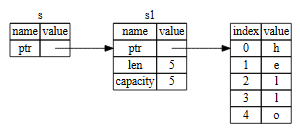
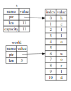

# rust

## 安装

一行代码安装，需要代理，不需要sudo

```bash
curl --proto '=https' --tlsv1.2 -sSf https://sh.rustup.rs | sh
```

## cargo常用命令

```bash
# 新建项目
cargo new xxx
# 运行项目
cargo run
cargo run -- arg1 arg2 arg3
# 编译、构建
cargo build
cargo build --release
# 检查
cargo check
```

## 语法和基本概念

### 变量及可变性

1. 变量声明使用关键字：let
2. 变量可变性，mut关键字
3. 命名方式：蛇形命名

```rust
//变量默认不可变，
let a = 1;
//想改变就要加mut关键字
let mut a = 1；
a = 2；
```

### 常量

1. 不能用mut修饰常量，常量永远不可变
2. 常量使用使用关键字：const
3. 常量声明必须显式的指明类型
4. 常量可以在任何作用域声明，常量在哪都能用
5. 约定俗成，常量名称全大写
6. 常量只在声明的作用域内有效
```rust
const MAX_POINTS: u32 = 100_000;
```

### 隐藏

1. 同名变量可以隐藏前一个变量，
2. 隐藏时可以变更变量类型

```rust
let a = 1;
let a = 2;
let a = "hello"; 
```

### 数据类型

#### 标量类型 scalar

1. 整数类型

    | 长度   | 有符号 | 无符号 |
    | ------ | ------ | ------ |
    | 8-bit  | i8     | u8     |
    | 16-bit | i16    | u16    |
    | 32-bit | i32    | u32    |
    | 64-bit | i64    | u64    |
    | arch   | isize  | usize  |

2. 整数字面值

    | 整数字面量      | 示例         |
    | --------------- | ------------ |
    | Byte（u8 only） | b'A'         |
    | Octal           | 0o77         |
    | Decimal         | 100_0000_000 |
    | Hex             | 0xff         |
    | Binary          | 0b11111      |

3. 整数的默认推导类型为i32

4. debug模式下，整数溢出会panic

5. 浮点类型：f32、f64

6. 浮点数默认推到类型为f64

7. 布尔类型bool

8. 字符类型char： 占4字节，表示unicode字符。

#### 复合类型 compound

1. 元组tuple：类型可以不同，长度固定

    ```rust
    // 元组定义
    let tup: (i32, f64, u8) = (500, 6.4, 1);
    // 元组解构
    let (x, y, z) = tup;
    // 元组访问
    let five_hundred = tup.0;
    let six_point_four = tup.1;
    ```

2. 数组array：类型相同，长度固定

    ```rust
    // 定义数组,注意数组类型是如何定义的
    let a0 = [i32; 5];
    let a1:[i32; 5] = [1, 2, 3, 4, 5];
    // 访问数组元素
    let first = a[0];
    // 数组越界，会panic
    let index = 10;
    let element = a[index];
    ```

### 函数

1. 命名方式：蛇形命名,下划线命名
2. 函数参数(形参)，为函数传参（实参）
3. 函数有多个语句构成，可以以表达式结尾。
4. 返回值： -> 函数最后一个表达式，作为函数返回值
   1. 没有返回值： -> ()
   2. 一个返回值： -> i32
   3. 多个返回值： -> (i32, i32)

- **语句：执行操作，但不返回值**
- **表达式：会进行计算并返回一个值作为结果的指令**

### 注释

```rust
// 这是个单行注释
/*
    这里是块注释
*/
```

### 控制流（分支、循环、跳转）

```rust
//
fn main(){
    let n:i32 = 3;
    // if 语句的基本用法
    if n > 5 {
        println!("number greater than 5");
    } else if n < 5 {
        println!("number lower than 5");
    } else {
        println!("number equal 5");
    }


    //判断中，不允许将数组转换为bool类型
    //if n { println!("hello");}

    // if语句是一个表达式，返回值可以给变量赋值
    let condition = true;
    let number = if condition { 5 } else { 6 };
    println!("The value of number is: {}", number);
    
    //loop语句基本用法,循环，使用break返回
    let i = 1;
    loop {
        if i > 10 {
            break;
        }
        println!("helloworld: {i}");
        i = i + 1;
    }

    // loop表达式，通过break返回值
    let i2:i32 = loop {
        break 100;
    }

    // while循环
    let mut n1 = 3；
    while n1 != 0 {
        println!("number: {n1}");
        n1 = n1 - 1;
    }

    // for循环，遍历集合
    let a = [10, 20, 30, 40, 50];
    for element in a {
        println!("the value is: {}", element);
    }
}
```

### 所有权

所有权规则：

1. Rust中的每个**值**都有一个被称为其所有者的变量。
2. **值**在任意时刻只能有一个所有者。
3. 所有者离开作用域，这个**值**将被丢弃。

所有权：

1. 内存在拥有它的变量离开作用域后就被自动释放，调用一个drop函数
2. 移动：将所有权yield给另一个变量，称为移动，移动后，原来的变量就不能使用了，移动类似浅拷贝
3. 克隆：栈上和堆上都要复制
4. 拷贝：只复制栈上的数据
5. 有drop trait的类型，不能拷贝，只能移动
6. 函数传参和返回值，都可能发生所有权转移

### 引用和借用

- 引用：&，这是个名词，类似指针，&String是String的引用
- 解引用： *
- 借用：这是个动词，引用变量的创建过程，就是在借用xx变量的值

    

- 引用可以声明为可变的
- 要么创建多个不可变引用，但是可变引用只能创建一个

### 切片 slice

- 切片是对集合的引用
- 字符串切片：&str，部分引用字符串

    ```rust
    let s = String::from("hello world");

    let hello = &s[0..5];
    let world = &s[6..11];
    ```

    

- 数组切片，也一样

    ```rust
    let a = [1, 2, 3, 4, 5];
    let slice0 = &a[1..3];
    let slice1 = &a[1..]; // 从1开始到结尾
    let slice1 = &a[0..3]; // 从0开始到3
    ```

### 结构体structure

```rust
// 定义结构体
struct User {
    active: bool,
    username: String,
    email: String,
    sign_in_count: u64,
}

fn main() {
    // 创建结构体实例
    let user1 = User {
        email: String::from("someone@example.com"),
        username: String::from("someusername123"),
        active: true,
        sign_in_count: 1,
    };
    // 访问结构体字段
    user1.email = String::from("anotheremail@example.com");
}
```

```rust
// 元组结构体
struct Color(i32, i32, i32);
struct Point(i32, i32, i32);
// 单元结构体
struct AlwaysEqual;

fn main() {
    let black = Color(0, 0, 0);
    let origin = Point(0, 0, 0);

    let subject = AlwaysEqual;
}
```

结构体数据的所有权： 结构体拥有所有字段的所有权，如果没有所有权，就需要使用生命周期

### 方法

1. &self 实际上是 self: &Self 的缩写。
2. 在一个 impl 块中，Self 类型是 impl 块的类型的别名
3. 要修改结构，则使用mut关键字


```rust
// 定义结构体
struct Rectangle { i32, i32 }
// 定义结构体的方法
impl Rectangle {
    fn area(&self) -> u32 { }
    fn set(&mut self,i32,i32) -> () { }
    // 这不是方法，是关联函数，不需要self参数
    fn square(size: u32) -> Rectangle {
        Rectangle {
            width: size,
            height: size,
        }
    }
}

```

### 枚举 enum

枚举定义
特殊枚举Option\<T>，用于空值
绑定值的枚举

### 匹配 match

1. 匹配必须有穷尽性
2. 通配符模式和_，可以匹配所有值
3. if let 语法糖，只匹配一个值，不需要穷尽性

### 模块 包  crate

- 包（Packages）： Cargo 的一个功能，它允许你构建、测试和分享 crate。
- Crates ：一个模块的树形结构，它形成了库或二进制项目。-
- 模块（Modules）和 use： 允许你控制作用域和路径的私有性。
- 路径（path）：一个命名例如结构体、函数或模块等项的方式

#### 包和crate

1. 一个包中至多 只能 包含一个库 crate(library crate)；
2. 包中可以包含任意多个二进制 crate(binary crate)；
3. 包中至少包含一个 crate，无论是库的还是二进制的。

src/main.rs
src/lib.rs
src/bin

#### 作用域和私有性

1. use关键字引入其他crate的pub属性的关键字，同时可以用as重命名
2. rust中默认都是私有的，
3. 通过模块mod，组织一类数据，模块可以嵌套
4. 模块数，树根就是src/lib.rs，然后层层嵌套

#### 路径

1. 使用路径定位模块中的项，就像文件系统的路径一样。
2. 相对路径：从当前模块开始，self， super，同级模块
3. 绝对路径：从根部（crate）开始，

use 类似于创建一个软连接

### 集合

1. Vector
2. String
3. HashMap

### 错误处理

1. 不可恢复错误：panic!
2. 可恢复错误：Result<T, E>

### 泛型 trait 生命周期

### 迭代器和闭包

1. 闭包： Rust 的 闭包（closures）是可以保存进变量或作为参数传递给其他函数的匿名函数。可以在一个地方创建闭包，然后在不同的上下文中执行闭包运算。不同于函数，闭包允许捕获调用者作用域中的值。

### 智能指针

#### Box\<T>

1. box 允许你将一个值放在堆上而不是栈上。留在栈上的则是指向堆数据的指针。
2. 应用场景示例：
    - 当有一个在编译时未知大小的类型，而又想要在需要确切大小的上下文中使用这个类型值的时候
    - 当有大量数据并希望在确保数据不被拷贝的情况下转移所有权的时候
    - 当希望拥有一个值并只关心它的类型是否实现了特定 trait 而不是其具体类型的时候
3. deref trait，可以当作引用,使用*
4. drop trait，当box离开作用域时，会自动调用drop函数，释放堆上的内存

